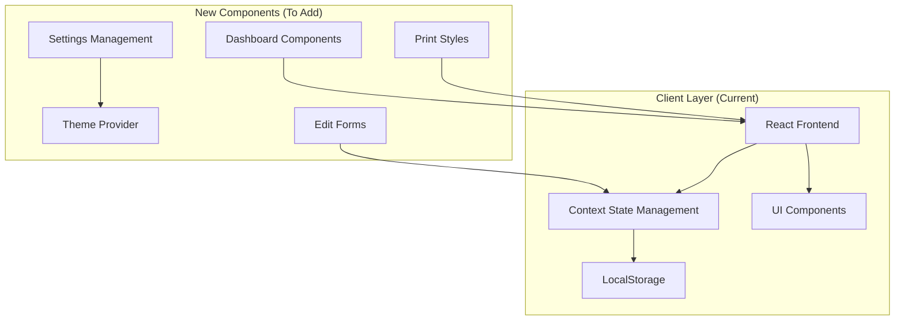

# Design Document

## Overview

This design document outlines the implementation approach for immediate enhancements to the existing quotation management system. The focus is on improving user experience, adding essential functionality, and addressing current styling and usability issues while maintaining the existing client-side architecture.

## Architecture

### Current System Architecture



### Enhanced Component Structure

```
src/
├── app/
│   ├── page.tsx (Dashboard - NEW)
│   ├── settings/
│   │   └── page.tsx (Settings Page - NEW)
│   ├── client/
│   │   ├── page.tsx (Updated with Edit)
│   │   ├── add/page.tsx
│   │   └── edit/[id]/page.tsx (NEW)
│   ├── organization/
│   │   ├── page.tsx (Updated with Edit)
│   │   ├── add/page.tsx
│   │   └── edit/[id]/page.tsx (NEW)
│   └── bank-details/
│       ├── page.tsx (Updated with Edit)
│       ├── add/page.tsx
│       └── edit/[id]/page.tsx (NEW)
├── components/
│   ├── dashboard/
│   │   ├── MetricsCard.tsx (NEW)
│   │   ├── QuotationChart.tsx (NEW)
│   │   ├── RecentQuotations.tsx (NEW)
│   │   └── QuickActions.tsx (NEW)
│   ├── settings/
│   │   ├── ThemeToggle.tsx (NEW)
│   │   ├── CompanySettings.tsx (NEW)
│   │   └── SettingsLayout.tsx (NEW)
│   └── shared/
│       ├── EditButton.tsx (NEW)
│       ├── LoadingSpinner.tsx (ENHANCED)
│       └── ErrorBoundary.tsx (NEW)
├── contexts/
│   ├── theme-context.tsx (NEW)
│   └── settings-context.tsx (NEW)
└── styles/
    └── print.css (NEW)
```

## Components and Interfaces

### Settings System

#### Settings Context Interface
```typescript
interface SettingsContextType {
  theme: 'light' | 'dark';
  companyName: string;
  toggleTheme: () => void;
  updateCompanyName: (name: string) => void;
  saveSettings: () => void;
}

interface SettingsState {
  theme: 'light' | 'dark';
  companyName: string;
  isLoading: boolean;
  error: string | null;
}
```

#### Theme Provider Interface
```typescript
interface ThemeProviderProps {
  children: React.ReactNode;
  defaultTheme?: 'light' | 'dark';
}

interface ThemeContextType {
  theme: 'light' | 'dark';
  setTheme: (theme: 'light' | 'dark') => void;
}
```

### Dashboard Components

#### Dashboard Data Interface
```typescript
interface DashboardMetrics {
  totalQuotations: number;
  quotationsByStatus: {
    draft: number;
    sent: number;
    accepted: number;
    rejected: number;
  };
  totalRevenue: number;
  recentQuotations: QuotationSummary[];
  monthlyTrends: MonthlyData[];
}

interface QuotationSummary {
  id: string;
  quotationNumber: string;
  clientName: string;
  total: number;
  status: string;
  date: string;
}

interface MonthlyData {
  month: string;
  quotations: number;
  revenue: number;
}
```

### Edit Form Components

#### Edit Form Props Interface
```typescript
interface EditFormProps<T> {
  data: T;
  onSave: (updatedData: T) => void;
  onCancel: () => void;
  isLoading?: boolean;
  validationErrors?: Record<string, string>;
}

interface EditClientFormProps extends EditFormProps<Client> {}
interface EditOrganizationFormProps extends EditFormProps<Organization> {}
interface EditBankDetailsFormProps extends EditFormProps<BankDetails> {}
```

## Styling and UI Framework

### Tailwind CSS Configuration
```typescript
// tailwind.config.js
module.exports = {
  darkMode: ["class"],
  content: [
    './pages/**/*.{ts,tsx}',
    './components/**/*.{ts,tsx}',
    './app/**/*.{ts,tsx}',
    './src/**/*.{ts,tsx}',
  ],
  theme: {
    extend: {
      colors: {
        border: "hsl(var(--border))",
        input: "hsl(var(--input))",
        ring: "hsl(var(--ring))",
        background: "hsl(var(--background))",
        foreground: "hsl(var(--foreground))",
        primary: {
          DEFAULT: "hsl(var(--primary))",
          foreground: "hsl(var(--primary-foreground))",
        },
        secondary: {
          DEFAULT: "hsl(var(--secondary))",
          foreground: "hsl(var(--secondary-foreground))",
        },
        destructive: {
          DEFAULT: "hsl(var(--destructive))",
          foreground: "hsl(var(--destructive-foreground))",
        },
        muted: {
          DEFAULT: "hsl(var(--muted))",
          foreground: "hsl(var(--muted-foreground))",
        },
        accent: {
          DEFAULT: "hsl(var(--accent))",
          foreground: "hsl(var(--accent-foreground))",
        },
        popover: {
          DEFAULT: "hsl(var(--popover))",
          foreground: "hsl(var(--popover-foreground))",
        },
        card: {
          DEFAULT: "hsl(var(--card))",
          foreground: "hsl(var(--card-foreground))",
        },
      },
    },
  },
  plugins: [require("tailwindcss-animate")],
}
```

### shadcn/ui Components to Use
- **Card**: For dashboard metrics and entity displays
- **Button**: For all interactive actions
- **Input**: For form fields
- **Label**: For form labels
- **Switch**: For theme toggle
- **Dialog**: For edit forms and confirmations
- **Badge**: For status indicators
- **Tabs**: For settings organization
- **Chart**: For dashboard analytics
- **Table**: For data display
- **Form**: For structured form handling

### Print Styles
```css
/* styles/print.css */
@media print {
  .no-print {
    display: none !important;
  }
  
  .print-only {
    display: block !important;
  }
  
  body {
    margin: 0;
    padding: 0;
    background: white !important;
    color: black !important;
  }
  
  .quotation-preview {
    max-width: none !important;
    box-shadow: none !important;
    border: none !important;
  }
  
  .page-break {
    page-break-before: always;
  }
  
  .avoid-break {
    page-break-inside: avoid;
  }
}
```

## Data Models

### Settings Data Models
```typescript
interface AppSettings {
  theme: 'light' | 'dark';
  companyName: string;
  companyLogo?: string;
  defaultCurrency: string;
  dateFormat: string;
  numberFormat: string;
}

interface ThemeConfig {
  mode: 'light' | 'dark';
  primaryColor: string;
  accentColor: string;
}
```

### Dashboard Data Models
```typescript
interface DashboardStats {
  totalQuotations: number;
  totalRevenue: number;
  conversionRate: number;
  averageQuotationValue: number;
  quotationsByStatus: StatusCount[];
  recentActivity: ActivityItem[];
  monthlyTrends: TrendData[];
}

interface StatusCount {
  status: string;
  count: number;
  percentage: number;
}

interface ActivityItem {
  id: string;
  type: 'created' | 'updated' | 'sent' | 'accepted';
  description: string;
  timestamp: Date;
  quotationNumber?: string;
}

interface TrendData {
  period: string;
  quotations: number;
  revenue: number;
}
```

## Error Handling

### Error Classification
```typescript
enum ErrorType {
  VALIDATION_ERROR = 'VALIDATION_ERROR',
  AUTHENTICATION_ERROR = 'AUTHENTICATION_ERROR',
  AUTHORIZATION_ERROR = 'AUTHORIZATION_ERROR',
  NOT_FOUND_ERROR = 'NOT_FOUND_ERROR',
  BUSINESS_LOGIC_ERROR = 'BUSINESS_LOGIC_ERROR',
  EXTERNAL_SERVICE_ERROR = 'EXTERNAL_SERVICE_ERROR',
  INTERNAL_SERVER_ERROR = 'INTERNAL_SERVER_ERROR'
}

interface AppError {
  type: ErrorType;
  message: string;
  code: string;
  statusCode: number;
  details?: any;
}
```

### Global Error Handler
```typescript
class ErrorHandler {
  static handle(error: AppError, req: Request, res: Response) {
    // Log error
    logger.error(error);
    
    // Send appropriate response
    res.status(error.statusCode).json({
      success: false,
      error: {
        code: error.code,
        message: error.message,
        ...(process.env.NODE_ENV === 'development' && { details: error.details })
      }
    });
  }
}
```

## Testing Strategy

### Testing Pyramid
1. **Unit Tests (70%)**
   - Service layer functions
   - Utility functions
   - Component logic
   - Validation functions

2. **Integration Tests (20%)**
   - API endpoint testing
   - Database operations
   - External service integrations
   - Authentication flows

3. **End-to-End Tests (10%)**
   - Critical user journeys
   - Quotation creation workflow
   - Authentication flows
   - Email sending process

### Test Structure
```typescript
// Example unit test
describe('QuotationService', () => {
  describe('calculateTotal', () => {
    it('should calculate total with GST correctly', () => {
      const items = [{ quantity: 2, rate: 100, amount: 200 }];
      const gstRate = 18;
      const result = QuotationService.calculateTotal(items, gstRate);
      expect(result.total).toBe(236);
    });
  });
});

// Example integration test
describe('POST /api/quotations', () => {
  it('should create quotation with valid data', async () => {
    const quotationData = createValidQuotationData();
    const response = await request(app)
      .post('/api/quotations')
      .set('Authorization', `Bearer ${authToken}`)
      .send(quotationData)
      .expect(201);
    
    expect(response.body.data.quotationNumber).toBeDefined();
  });
});
```

## Security Considerations

### Authentication & Authorization
- JWT tokens with short expiration times
- Refresh token rotation
- Role-based access control (RBAC)
- Multi-factor authentication for admin users

### Data Protection
- Encryption at rest using AES-256
- TLS 1.3 for data in transit
- Input validation and sanitization
- SQL injection prevention using parameterized queries

### API Security
- Rate limiting per user/IP
- CORS configuration
- Request size limits
- API versioning for backward compatibility

### Audit & Compliance
- Comprehensive audit logging
- Data retention policies
- GDPR compliance for EU users
- Regular security assessments

## Performance Optimization

### Database Optimization
- Proper indexing strategy
- Query optimization
- Connection pooling
- Read replicas for reporting

### Caching Strategy
- Redis for session storage
- API response caching
- Database query result caching
- CDN for static assets

### Frontend Optimization
- Code splitting and lazy loading
- Image optimization
- Bundle size optimization
- Service worker for offline capability

## Deployment Architecture

### Infrastructure
```yaml
# Docker Compose for development
version: '3.8'
services:
  frontend:
    build: ./frontend
    ports:
      - "3000:3000"
    environment:
      - REACT_APP_API_URL=http://localhost:8000
  
  backend:
    build: ./backend
    ports:
      - "8000:8000"
    environment:
      - DATABASE_URL=postgresql://user:pass@db:5432/quotations
      - REDIS_URL=redis://redis:6379
    depends_on:
      - db
      - redis
  
  db:
    image: postgres:15
    environment:
      - POSTGRES_DB=quotations
      - POSTGRES_USER=user
      - POSTGRES_PASSWORD=pass
    volumes:
      - postgres_data:/var/lib/postgresql/data
  
  redis:
    image: redis:7-alpine
    volumes:
      - redis_data:/data
```

### Production Deployment
- Kubernetes orchestration
- Auto-scaling based on load
- Blue-green deployment strategy
- Monitoring with Prometheus/Grafana
- Centralized logging with ELK stack

## Migration Strategy

### Phase 1: Backend Foundation (Weeks 1-4)
- Set up backend infrastructure
- Implement authentication system
- Create core API endpoints
- Database schema implementation

### Phase 2: Core Features (Weeks 5-8)
- Migrate existing functionality to backend
- Implement quotation workflow
- Add template system
- Email integration

### Phase 3: Advanced Features (Weeks 9-12)
- Client portal development
- Reporting and analytics
- Product catalog management
- Integration capabilities

### Phase 4: Enhancement & Polish (Weeks 13-16)
- Performance optimization
- Security hardening
- Comprehensive testing
- Documentation completion

## Monitoring & Observability

### Application Metrics
- Response time monitoring
- Error rate tracking
- User activity analytics
- Business metrics (quotations created, conversion rates)

### Infrastructure Metrics
- Server resource utilization
- Database performance
- Cache hit rates
- Network latency

### Alerting Strategy
- Critical error notifications
- Performance degradation alerts
- Security incident alerts
- Business metric anomalies